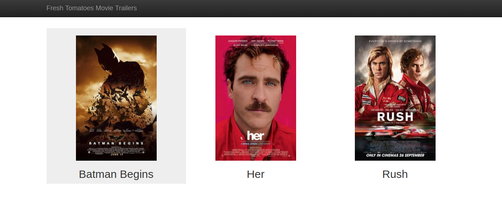

Udacity Movie Trailer Website
==

> Simple python scripts to show a list of must watch movies in a pretty web page.




# Prerequisites
To execute this project you will need `python` and `git` installed in your computer.

It works with both python 2 and python 3.

# Usage
Clone the project and execute:

```shell
git clone https://github.com/tiagoengel/movie_trailer.git
cd movie_trailer
python entertainment_center.py
```

It will generate a html and open it in your browser.